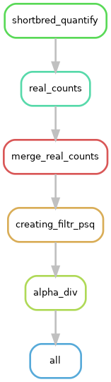

# FlaPro: human gut microbiome flagellome profiler

A workflow for quantifying bacterial flagellins in human gut microbiome sequencing data, annotating their human TLR5 interaction phenotypes and conducting statistical analysis and visualization.

## Installation
``````
git clone https://github.com/leylabmpi/FlaPro.git
cd ./FlaPro/snakemake/bin/
git submodule add https://github.com/leylabmpi/ll_pipeline_utils.git
git submodule update --remote --init --recursive
cd ../
``````

If conda is used, then:

```
conda env create -f snakemake8_min.yaml
```

If not, singularity image is provided and can be pulled with `singularity` or `apptainer` (ensure to have SylabsCloud if apptainer is used `apptainer remote add --no-login SylabsCloud cloud.sylabs.io`,  `apptainer remote use SylabsCloud`):

```
mkdir images
cd images
singularity pull library://aaaabogdanova/flapro/primary_env:latest
singularity pull library://aaaabogdanova/flapro/secondary_env:latest

cd ../
```


One have to download usearch if needed in the following directory:

```
cd bin/script
mkdir usearch

cd usearch

wget ./ {usearch_download_link} (might be found here: https://www.drive5.com/usearch/download.html)

gzip -d {usearch.gzip}

```

An example of running FlaPro is provided as a bash script in the snakemake pipeline directory:

``````
#conda based
./runLLHFP.sh #Important: user should modify the script in order to initialize conda correctly (see the instructions in the script)

#container based
#first, load the snakemake module, if modular system is used or any other ways to enable snakemake
#then,
./runAppt.sh
``````

## Primary analysis
### Scheme


### Input Files
*User-provided*
- **Metagenomic or Metatranscriptomic samples** - reads in FASTQ or FASTA format (optionally compressed)

*Reference data*
- **Taxonomical annotation of flagellins** 
- **Functional annotation of flagellins** 
- **Marker sequences from human gut microbiome derived flagellins** 

### Setting up the config file
#### 1. Basic structure

The config.yaml file is organized into several main sections:
- Input data
- Output directory
- Workflow control settings
- Parameters

#### 2. Sample input configuration

*config.yaml* - default configuration file. Edit this, if use conda-based environment
*config_apptainer.yaml* - configuration file with enabled container. Edit this file, if conda is unavailable.

##### 2.1 Input data
Specify the path to a sample file containing your metagenomic or meta-transcriptomic sample-to-read-file mappings:
```yaml
# format example file:
samples_file: datatest/input_MTG4_nano.txt
```

**The sample sheet file should include:**
- Sample ID
- Relative or absolute path to the forward reads (R1)
- Relative or absolute path to the reverse reads (R2), in case of paired-end sequencing

**Paired-end example:**
```
Sample    Read1                          Read2
sample1   /path/to/sample1_R1.fastq.gz   /path/to/sample1_R2.fastq.gz
sample2   /path/to/sample2_R1.fastq.gz   /path/to/sample2_R2.fastq.gz
```

**Single-end example (omit the Read2 column entirely):**
```
Sample    Read1
sample1   /path/to/sample1_R1.fastq.gz
sample2   /path/to/sample2_R1.fastq.gz
```

##### 2.2 Base path
Define the root folder corresponding to the relative paths above:
```yaml
read_file_path: None  # when the paths are absolute
# read_file_path: /path/to/your/reads/  # when the paths are relative
```

#### 3. Output directory
Provide the destination directory for the primary analysis output, for example:
```yaml
output_dir: out/test_ibd_MTG4_nano_test/
```

#### 4. Workflow control settings
##### 4.1 Temporary directory
Specify the location for the temporary files (ensure there is enough room in case of large datasets):
```yaml
tmp_dir: tmp/  # Adjust based on your system's temp directory
```

##### 4.2 Pipeline Steps Control
Enable/disable major pipeline components:
```yaml
run_pipeline_steps:  
  alpha_div: True   #or False       # Enable alpha diversity calculations
```

#### 5. Snakemake configuration
Configure the Snakemake workflow execution:
```yaml
pipeline:
  snakemake_folder: ./                    # Path to Snakemake files
  export_conda: True                      # Export conda environment
  name: LLHFP                            # Pipeline name identifier
```

#### 6. Parameters

##### 6.1 ShortBRED quantification parameters
```yaml
params:
  shortbred_quantify:
    aligner: diamond                      # Options: diamond, usearch
    # usearch_path: bin/scripts/usearch/usearch11.0.667_i86linux32  # uncomment, if using USEARCH
    markers: ref/Curated_fla_markers_4_04-12-24.fasta  # Flagellin marker database
    pct_length: 0.3                       # Minimum alignment length (30%)
```
**Aligner Options:**
- `diamond`: Faster, fewer false positives, recommended for large datasets
- `usearch`: More sensitive; the freely available version might not work with large datasets

##### 6.2 Results merging parameters
```yaml
  merge_realcounts:
    merge_script: snakemake/bin/scripts/merge_realcounts.R
```

#### 7. Examples of configurations
See `config.yaml` and `config_apptainer.yaml`

### Output files
Example:
`./real_counts |`

              `SRR5935740.txt` - output per sample with Family (Cluster), Hits,
              
              `merged_realcounts.txt` - merged output for all the samples by real counts
              
              `psq.RData` - psq object with taxonomy and abundance table
`./diversity |`
              
              `alpha_div.txt` - calculated alpha diversity tables

#### Interpreting the per-sample `real_counts/*.txt` files

Each per-sample table has one row per flagellin family (marker cluster) with the following columns:

| Column | Meaning |
| --- | --- |
| **Family** | Flagellin family / marker cluster ID. |
| **Count** | **Normalized (RPKM) abundance** – reads per kilobase of reference sequence per million sample reads. Technically it is the *median* of the per-marker RPKM values across all markers that belong to the family. |
| **Hits** | **Raw read count** – the number of reads mapped to the family's markers (not normalized). |
| **TotMarkerLength** | Summed length (in amino acids) of the family's markers. |
| **RealCount** | Equal to **Hits** when **Count > 0**, and `0` otherwise – i.e. the raw read count *after* ShortBRED's detection threshold has been applied (see below). |

**Detection threshold.** `Count` is a *median* over the family's markers, which is what makes ShortBRED's abundance estimate robust: for `Count` to be non-zero, more than ~50 % of a cluster's markers must be matched by reads from the sample. When fewer than half of the markers are hit, the family's abundance is deemed unreliable and set to `0`. `RealCount` mirrors this filter on the raw counts (`Hits` are kept only where `Count > 0`), so that the discrete, non-normalized counts remain available for downstream statistical analyses and custom normalization.

> In short: **`Count` = normalized RPKM abundance**, **`Hits` / `RealCount` = raw (threshold-filtered) read counts.** Use whichever value best fits your downstream analysis.

## Secondary analysis
After the primary analysis has finished successfully to yield the annotated flagellin relative abundance tables, you can add your sample metadata and do exploratory analysis using the secondary analysis code. It is provided in the form of R Jupyter notebooks (.ipynb files).

To set up the environment for the secondary analysis, you will need:
- Conda (https://docs.conda.io/en/latest/)
- Visual Studio Code (or an alternative integrated development enviroment supporting running R notebooks via a defined Conda environment)

Create a specific Conda environment using the YAML file provided in the envs/ folder:
```bash
conda env create -f r_433_nb.yaml
conda activate r_433_nb
```

Then install the following non-Conda -based packages into it:
```bash
R
devtools::install_github("tpq/balance")
devtools::install_github("malucalle/selbal")
devtools::install_bitbucket("knomics/nearestbalance")
devtools::install_github("leylabmpi/LeyLabRMisc")
```
(these instructions can be also run using the provided envs/...postBuild.sh script) 

Open the notebook in VS Code, select the R Jupyter kernel of the installed environment and run the notebook.
Further information on how to generate your own notebooks easily synchronizable across multiple projects is provided in a [separate readme file](/notebooks/differential_analysis/notebook_generator/README.md).

Note: while the main input files for the secondary analysis are generated during the primary analysis, you have to prepare the additional files with the number of reads per sample (sample coverage), for example, using the `scripts/count_reads.sh` script.
